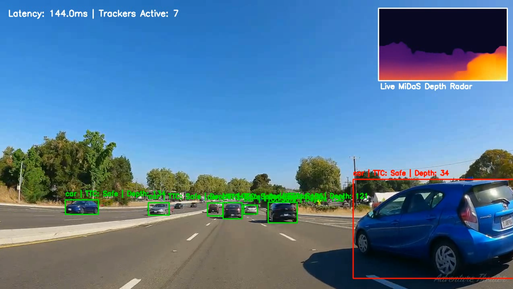

# VisionFusion ADAS

### Monocular Vision-Based Collision Risk Assessment using YOLOv8, MiDaS, Tracking, and Time-To-Collision Estimation



**VisionFusion ADAS** is a computer vision system that transforms a standard monocular camera into a lightweight Advanced Driver Assistance System (ADAS).

The project combines real-time object detection, multi-object tracking, monocular depth estimation, and Time-To-Collision (TTC) analysis to estimate collision risk in highway driving scenarios without requiring LiDAR, radar, stereo cameras, or specialized hardware.

---

## Demo Video

https://youtu.be/VMLkfBw-CnQ

The demo demonstrates:

* Real-time vehicle detection
* Persistent object tracking
* Monocular depth estimation
* Time-To-Collision prediction
* Dynamic collision-risk assessment
* Live depth radar visualization

---

## Motivation

Traditional object detection systems can identify vehicles but cannot determine how far they are from the camera or whether they pose an immediate collision threat.

My initial implementation relied solely on YOLO detections and bounding-box size to estimate danger. This approach suffered from a fundamental limitation:

### Scale Ambiguity

A large truck far away may occupy a larger image region than a nearby motorcycle.

As a result, bounding-box size alone is not a reliable indicator of collision risk.

To address this problem, VisionFusion introduces a depth-aware perception pipeline that combines object detection, monocular depth estimation, and temporal reasoning.

---

## Key Features

### Vehicle Detection

* YOLOv8 Nano
* Real-time inference
* Vehicle-specific filtering
* Cars
* Motorcycles
* Buses
* Trucks

### Multi-Object Tracking

Persistent object IDs are maintained across frames using YOLO tracking mode.

Tracking enables:

* Motion estimation
* Relative velocity computation
* Time-To-Collision analysis

### Monocular Depth Estimation

MiDaS Small generates a dense depth map from a single RGB image.

The system extracts depth information within each detected vehicle bounding box to estimate relative distance from the ego vehicle.

### Time-To-Collision (TTC)

Collision risk is estimated using:

TTC = Distance / Relative Approach Velocity

Rather than relying on object size, the system evaluates how quickly the distance between vehicles is shrinking.

### Live Depth Radar

A picture-in-picture depth visualization displays the scene's estimated depth structure in real time.

### Collision Risk Assessment

Objects are categorized into three risk levels:

| Risk Level | Condition |
| ---------- | --------- |
| Safe       | TTC ≥ 6 s |
| Warning    | TTC < 6 s |
| Critical   | TTC < 3 s |

Visual indicators:

* Green → Safe
* Orange → Warning
* Red → Critical

---

## Engineering Challenge: The "Disco Box" Problem

After integrating YOLO and MiDaS, a new issue emerged.

Bounding boxes frequently oscillated between risk levels despite the scene appearing stable.

Root causes included:

* Bounding-box jitter
* Noisy depth estimates
* Small frame-to-frame timing variations
* Velocity spikes caused by depth fluctuations

This produced unstable warnings and poor user experience.

---

## Solution: EMA-Based Temporal Stabilization

To suppress noisy measurements, an Exponential Moving Average (EMA) filter was introduced.

### Distance Smoothing

Depth measurements are blended with historical estimates.

### Velocity Smoothing

Relative velocity estimates are independently smoothed to prevent extreme TTC spikes.

Benefits:

* Stable warning boxes
* Reduced false alarms
* Consistent TTC estimation
* Improved visual clarity
* Better temporal robustness

This stabilization layer represents the final iteration of the project.

---

## System Architecture

### Stage 1: Object Detection & Tracking

YOLOv8 identifies vehicles and assigns persistent track IDs.

### Stage 2: Depth Estimation

MiDaS generates a dense monocular depth map.

### Stage 3: Sensor Fusion

Detected vehicle regions are mapped onto the depth image.

Median depth values are extracted for each tracked object.

### Stage 4: Temporal Analysis

Historical depth measurements are used to estimate approach velocity.

### Stage 5: Time-To-Collision Estimation

TTC is computed using relative distance and closing speed.

### Stage 6: Risk Visualization

Objects are color-coded based on collision risk.

---

## Project Evolution

### Version 1 — YOLO-Based Collision Warning

Features:

* Vehicle detection
* Confidence scores
* Bounding-box area heuristic
* FPS monitoring

Limitations:

* No depth perception
* No tracking
* Frequent false warnings
* Scale ambiguity problem

---

### Version 2 — VisionFusion

Added:

* MiDaS depth estimation
* Multi-object tracking
* TTC computation
* Depth radar visualization

Result:

* Spatial awareness
* Motion understanding
* More realistic collision assessment

---

### Version 3 — VisionFusion (Final)

Added:

* EMA distance smoothing
* EMA velocity smoothing
* Stable TTC estimates
* Robust warning visualization

Result:

* Significantly improved stability
* Reduced warning oscillations
* Better user experience

---

## Technology Stack

* Python
* OpenCV
* PyTorch
* Ultralytics YOLOv8
* MiDaS
* NumPy

---

## Repository Structure

```text
VisionFusion-ADAS/
│
├── README.md
├── requirements.txt
├── .gitignore
│
├── visionfusion_adas.py
│
├── assets/
│   └── visionfusion_demo.png
│
├── results/
│   ├── metrics_report.txt      # Generated when --metrics is enabled
│   └── frame_log.csv           # Generated when --metrics is enabled
│
└── driving_video.mp4           # Input video
```

### Directory Description

| Path | Purpose |
|--------|--------|
| `visionfusion_adas.py` | Main VisionFusion ADAS pipeline |
| `assets/` | Images used in the README |
| `results/metrics_report.txt` | Performance evaluation report generated by the metrics mode |
| `results/frame_log.csv` | Frame-level telemetry and tracking statistics |
| `driving_video.mp4` | Input video for testing |
| `vision_fusion_output.mp4` | Annotated output video generated after processing |

---

## Installation

### 1. Clone the Repository

```bash
git clone https://github.com/begin25/VisionFusion-ADAS.git
cd VisionFusion-ADAS
```

### 2. (Optional) Create a Virtual Environment

```bash
python -m venv venv
```

Activate it:

**Windows**

```bash
venv\Scripts\activate
```

**Linux / macOS**

```bash
source venv/bin/activate
```

### 3. Install Dependencies

```bash
pip install -r requirements.txt
```

If installing manually:

```bash
pip install torch torchvision ultralytics opencv-python numpy matplotlib timm
```

### 4. Prepare Input Video

Place your test video in the repository root directory and name it:

```text
driving_video.mp4
```

---

## Running the Project

### Standard Mode

Runs the complete VisionFusion ADAS pipeline and generates an annotated output video.

```bash
python visionfusion_adas.py
```

Output:

```text
vision_fusion_output.mp4
```

---

### Metrics Mode

Runs the same ADAS pipeline and additionally generates performance statistics and frame-level telemetry.

```bash
python visionfusion_adas.py --metrics
```

Outputs:

```text
vision_fusion_output.mp4

results/
├── metrics_report.txt
└── frame_log.csv
```

---

## Generated Outputs

### Annotated Output Video

```text
vision_fusion_output.mp4
```

Contains:

- Vehicle detection
- Persistent object tracking
- Monocular depth estimation
- Time-To-Collision (TTC) estimation
- Risk classification
- Live depth radar visualization

### Metrics Report

Generated only when using:

```bash
python visionfusion_adas.py --metrics
```

Location:

```text
results/metrics_report.txt
```

Contains:

- Mean latency
- P95 latency
- Maximum latency
- Effective FPS
- Tracking statistics
- Risk distribution
- EMA smoothing configuration

### Frame-Level Telemetry

Generated only when using:

```bash
python visionfusion_adas.py --metrics
```

Location:

```text
results/frame_log.csv
```

Contains per-frame records including:

- Frame number
- Latency
- Active tracker count
- Critical warnings
- Warning states
- Safe states

---

## Example Workflow

```text
Input Video
      │
      ▼
YOLOv8 Detection
      │
      ▼
Multi-Object Tracking
      │
      ▼
MiDaS Depth Estimation
      │
      ▼
EMA Smoothing
      │
      ▼
Time-To-Collision (TTC)
      │
      ▼
Risk Classification
      │
      ▼
Annotated Output Video
      │
      ├── Standard Mode
      │       └── vision_fusion_output.mp4
      │
      └── Metrics Mode
              ├── vision_fusion_output.mp4
              ├── results/metrics_report.txt
              └── results/frame_log.csv
```
---

## Limitations

* Monocular depth is relative rather than metric.
* Performance may degrade in poor lighting conditions.
* TTC assumes smooth object motion.
* Detection is limited to selected vehicle classes.
* Real-world deployment would require calibrated sensors and extensive validation.

---

## Future Work

* Metric depth calibration
* Lane detection
* Sensor fusion with radar or LiDAR
* Vehicle trajectory prediction
* Driver alert generation
* Edge-device optimization
* Real-time deployment

---
## 📊 Results & Performance Evaluation

The pipeline was evaluated over a continuous 60-second driving sequence totaling 1,800 frames, processed entirely on a CPU baseline configuration to analyze edge-compute viability.

### System Performance
| Metric | Value |
|---|---|
| **Total frames processed** | 1,800 |
| **Mean latency** | 156.3 ms |
| **P95 latency** | 184.8 ms |
| **Max latency** | 710.8 ms |
| **Effective throughput** | 6.4 FPS |

### Detection and Tracking Robustness
| Metric | Value |
|---|---|
| **Unique vehicles tracked** | 280 |
| **Average simultaneous trackers** | 7.3 per frame |
| **Longest persistent track** | 1,109 frames (~37 seconds) |

### Risk Classification Distribution
Across all vehicle detection instances, the EMA-stabilized risk thresholds categorized tracking states into the following distributions:

| Risk Level | % of Total Detections |
|---|---|
| 🟢 **Safe** | 36.0% |
| 🟠 **Warning** *(TTC < 6.0s or depth < 80)* | 32.8% |
| 🔴 **Critical** *(TTC < 3.0s or depth < 40)* | 31.2% |

> *Note on Risk Metrics: The 'Critical' classification tier holds a high distribution (31.2%) due to the conservative absolute proximity threshold (`depth < 40`). This design parameter inherently flags vehicles operating safely but closely in adjacent parallel lanes. Integrating a downstream lane-line segmentation network will restrict critical TTC calculations exclusively to the ego-lane.*

### 🛠️ Algorithmic Stability & Smoothing (EMA Filter Implementation)

A primary challenge with raw deep-learning outputs in vision pipelines is high frame-to-frame variance. To eliminate physical bounding box jitter from the detector and minor structural fluctuations within the monocular depth map, a dual-stage **Exponential Moving Average (EMA)** signal-processing filter was engineered into the core tracking framework.

| Parameters & Configuration | Value / Setting | Functional Objective |
| :--- | :--- | :--- |
| **Smoothing Strategy** | Exponential Moving Average (EMA) | Acts as a mathematical shock absorber to compute fluid trendlines rather than reacting to instantaneous sensor glitches. |
| **Distance Smoothing (`alpha_dist`)** | `0.30` | Smooths out raw regional median depth extractions, effectively mitigating boundary box edge vibrations. |
| **Velocity Smoothing (`alpha_vel`)** | `0.15` | Applied heavily to the relative approach-velocity calculation to suppress massive delta spikes caused by minute timing variables ($\Delta t$). |
| **Engineering Outcome** | **Successfully Stabilized** | Drastically reduced false-positive warning switches, eliminating chaotic UI flashing and securing a consistent, reliable Time-To-Collision (TTC) countdown. |

### Model Reference

| Model | Detail |
|---|---|
| **YOLOv8n** | COCO mAP@50: 52.3% (pretrained baseline) |
| **MiDaS Small** | Intel ISL, zero-shot monocular depth |

---

## Author

**Vaibhav Jain**  

B.Tech, Production & Industrial Engineering  
Indian Institute of Technology, Delhi  

Interests:

* Computer Vision
* Autonomous Systems
* Machine Learning
* Mathematical Optimization
